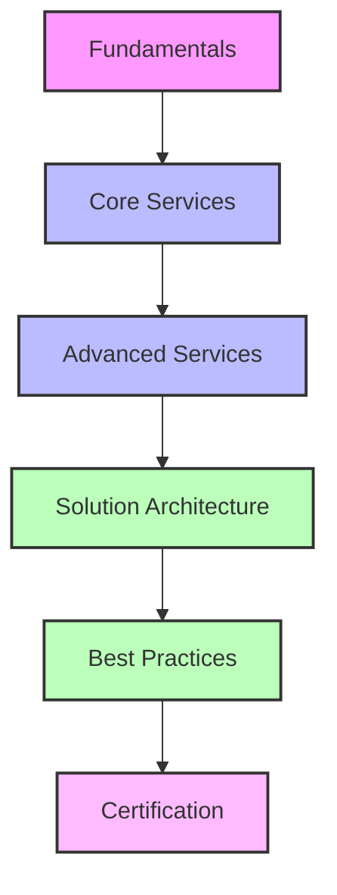

# Huawei Solution Architect Learning Plan

## Introduction

This learning plan is designed to help you become proficient in Huawei Cloud solutions architecture. It combines theoretical knowledge with hands-on practice using your existing Terraform project as a foundation.

## Learning Path Overview



## Week 1-2: Huawei Cloud Fundamentals

### Learning Objectives
- Understand Huawei Cloud's global infrastructure
- Learn about regions, availability zones, and edge locations
- Master account setup, IAM, and security fundamentals
- Explore the Huawei Cloud console and CLI

### Activities
1. **Account Setup**
   - Create a Huawei Cloud account if not already done
   - Set up proper IAM users and permissions
   - Configure MFA for enhanced security

2. **Console Exploration**
   - Navigate through the Huawei Cloud console
   - Understand the dashboard and service catalog
   - Learn how to access billing and usage information

3. **CLI Setup**
   - Install and configure the Huawei Cloud CLI
   - Practice basic CLI commands
   - Compare CLI vs Console operations

4. **Documentation Review**
   - Read through Huawei Cloud's official documentation
   - Understand service level agreements (SLAs)
   - Review pricing models and billing structure

### Project Tasks
- Update your Terraform configuration with proper IAM roles
- Implement best practices for securing your Huawei Cloud account

## Week 3-4: Core Services

### Learning Objectives
- Master Virtual Private Cloud (VPC) concepts and implementation
- Understand Elastic Cloud Server (ECS) options and use cases
- Learn about storage solutions (OBS, EVS, SFS)
- Explore database services (RDS, DDS, GaussDB)

### Activities
1. **Networking Deep Dive**
   - VPC design and implementation
   - Subnets, routing tables, and security groups
   - VPN and Direct Connect options
   - Elastic IP and NAT Gateway

2. **Compute Services**
   - ECS instance types and selection criteria
   - Auto Scaling configuration
   - Bare Metal Server options
   - Container services (CCE)

3. **Storage Solutions**
   - Object Storage Service (OBS) for unstructured data
   - Elastic Volume Service (EVS) for block storage
   - Scalable File Service (SFS) for file storage
   - Data migration strategies

4. **Database Services**
   - Relational Database Service (RDS)
   - Document Database Service (DDS)
   - GaussDB for enterprise workloads
   - Database backup and recovery strategies

### Project Tasks
- Enhance your Terraform configuration to include:
  - Multiple subnets within your VPC
  - ECS instances with appropriate security groups
  - Storage resources (OBS buckets, EVS volumes)
  - A basic RDS instance

## Week 5-6: Advanced Services

### Learning Objectives
- Understand load balancing and content delivery
- Master container and serverless technologies
- Learn about big data and AI services
- Explore IoT platform capabilities

### Activities
1. **Application Services**
   - Elastic Load Balance (ELB) configuration
   - Content Delivery Network (CDN) implementation
   - API Gateway setup and management
   - Application Operations Management (AOM)

2. **Container and Serverless**
   - Cloud Container Engine (CCE) for Kubernetes
   - Software Repository for Container (SWR)
   - FunctionGraph for serverless computing
   - CloudIDE for development

3. **Big Data and AI**
   - MapReduce Service (MRS)
   - Data Lake Insight (DLI)
   - ModelArts for AI development
   - Data visualization tools

4. **IoT Services**
   - IoT Platform basics
   - Device access and management
   - IoT data processing
   - Edge computing options

### Project Tasks
- Extend your Terraform configuration to include:
  - Load balancers for your application tier
  - Container deployments using CCE
  - Serverless functions for specific tasks
  - Basic monitoring and logging setup

## Week 7-8: Solution Architecture

### Learning Objectives
- Learn architectural design principles for Huawei Cloud
- Understand high availability and disaster recovery
- Master cost optimization strategies
- Explore hybrid and multi-cloud scenarios

### Activities
1. **Architecture Patterns**
   - Web application architectures
   - Microservices implementation
   - Event-driven architectures
   - Big data architectures

2. **High Availability**
   - Multi-AZ deployments
   - Global load balancing
   - Database replication and failover
   - Disaster recovery planning

3. **Cost Optimization**
   - Reserved and spot instance strategies
   - Right-sizing resources
   - Storage tiering and lifecycle policies
   - Monitoring and controlling costs

4. **Hybrid Cloud**
   - Connecting on-premises to Huawei Cloud
   - Data migration strategies
   - Consistent security models
   - Hybrid management tools

### Project Tasks
- Redesign your Terraform configuration for:
  - High availability across multiple AZs
  - Disaster recovery capabilities
  - Cost-optimized resource selection
  - Comprehensive monitoring and alerting

## Week 9-10: Best Practices and Advanced Topics

### Learning Objectives
- Implement security best practices
- Master DevOps on Huawei Cloud
- Learn performance optimization techniques
- Understand compliance and governance

### Activities
1. **Security in Depth**
   - Data encryption strategies
   - Security Center implementation
   - Advanced IAM policies
   - Security assessment and penetration testing

2. **DevOps Integration**
   - CodeArts for CI/CD
   - Infrastructure as Code advanced patterns
   - Monitoring and observability
   - Automated testing strategies

3. **Performance Optimization**
   - Application performance monitoring
   - Database optimization techniques
   - Network performance tuning
   - Caching strategies

4. **Governance and Compliance**
   - Resource organization and tagging
   - Policy management
   - Compliance frameworks
   - Audit and logging best practices

### Project Tasks
- Enhance your Terraform configuration with:
  - Advanced security controls
  - CI/CD pipeline integration
  - Performance monitoring and auto-scaling
  - Compliance-ready resource configurations

## Week 11-12: Certification Preparation

### Learning Objectives
- Prepare for Huawei Cloud certification exams
- Review key concepts and services
- Practice with sample questions and scenarios
- Develop test-taking strategies

### Activities
1. **Exam Preparation**
   - Review official exam guides
   - Take practice tests
   - Join study groups or forums
   - Review service limits and quotas

2. **Hands-on Labs**
   - Complete all recommended hands-on labs
   - Practice troubleshooting scenarios
   - Time yourself on complex deployments
   - Review and optimize existing architectures

3. **Documentation Review**
   - Re-read key service documentation
   - Review architectural whitepapers
   - Study case studies and reference architectures
   - Create summary notes for quick review

### Project Tasks
- Create a comprehensive demo environment that showcases:
  - Enterprise-grade architecture
  - Security best practices
  - High availability and disaster recovery
  - Cost optimization

## Resources

### Official Documentation
- [Huawei Cloud Official Documentation](https://support.huaweicloud.com/intl/en-us/index.html)
- [Huawei Cloud Academy](https://edu.huaweicloud.com/intl/en-us/programs)
- [Terraform Huawei Cloud Provider](https://registry.terraform.io/providers/huaweicloud/huaweicloud/latest/docs)

### Learning Platforms
- Huawei Cloud Academy
- Coursera Huawei Cloud courses
- Udemy specialized courses
- YouTube tutorials and webinars

### Communities
- Huawei Developer Forums
- Stack Overflow (huawei-cloud tag)
- GitHub repositories with Huawei Cloud examples
- LinkedIn groups for Huawei Cloud professionals

## Project Structure

As you progress through this learning plan, you'll expand your Terraform project to include more services and best practices. Here's a suggested structure for your project:

```
huawei-cloud/
├── .gitignore
├── README.md
├── docs/
│   ├── architecture-diagrams/
│   ├── service-notes/
│   └── best-practices/
├── terraform/
│   ├── environments/
│   │   ├── dev/
│   │   ├── test/
│   │   └── prod/
│   ├── modules/
│   │   ├── networking/
│   │   ├── compute/
│   │   ├── storage/
│   │   ├── database/
│   │   └── security/
│   └── global/
└── scripts/
    ├── setup/
    ├── monitoring/
    └── maintenance/
```

## Progress Tracking

Create a progress tracking system to monitor your learning journey:

1. **Weekly Goals**: Set specific goals for each week
2. **Service Checklist**: Mark off services as you learn them
3. **Project Milestones**: Track the evolution of your Terraform project
4. **Knowledge Assessment**: Regularly test your understanding with quizzes

## Conclusion

This learning plan provides a structured approach to mastering Huawei Cloud for solution architects. By combining theoretical learning with hands-on practice, you'll develop the skills needed to design, implement, and manage complex solutions on Huawei Cloud.

Remember to adapt this plan to your specific learning pace and focus areas. The key to success is consistent practice and application of concepts through your Terraform project.
