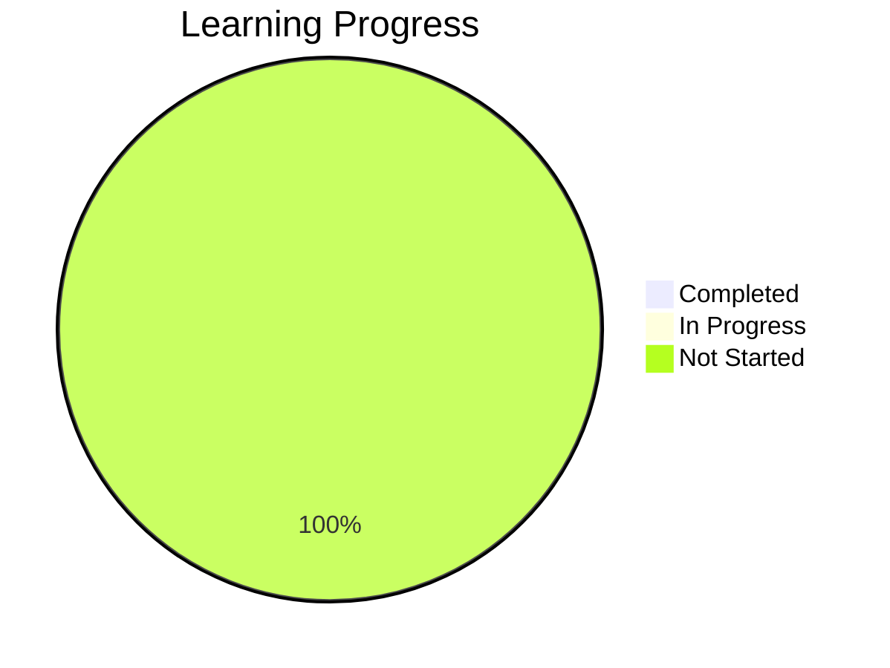

# Huawei Cloud Solution Architect Learning Progress

Use this file to track your progress through the learning plan. Update it regularly as you complete sections.

## Overall Progress



## Week 1-2: Huawei Cloud Fundamentals

### Account Setup
- [ ] Create Huawei Cloud account
- [ ] Set up IAM users and permissions
- [ ] Configure MFA for security
- [ ] Notes:
```
Add your notes here...
```

### Console Exploration
- [ ] Navigate through Huawei Cloud console
- [ ] Understand dashboard and service catalog
- [ ] Learn about billing and usage information
- [ ] Notes:
```
Add your notes here...
```

### CLI Setup
- [ ] Install Huawei Cloud CLI
- [ ] Configure CLI with credentials
- [ ] Practice basic CLI commands
- [ ] Compare CLI vs Console operations
- [ ] Notes:
```
Add your notes here...
```

### Documentation Review
- [ ] Read official documentation
- [ ] Understand SLAs
- [ ] Review pricing models
- [ ] Notes:
```
Add your notes here...
```

### Project Tasks
- [ ] Update Terraform with IAM roles
- [ ] Implement security best practices
- [ ] Notes:
```
Add your notes here...
```

## Week 3-4: Core Services

### Networking Deep Dive
- [ ] VPC design and implementation
- [ ] Subnets, routing tables, and security groups
- [ ] VPN and Direct Connect options
- [ ] Elastic IP and NAT Gateway
- [ ] Notes:
```
Add your notes here...
```

### Compute Services
- [ ] ECS instance types and selection
- [ ] Auto Scaling configuration
- [ ] Bare Metal Server options
- [ ] Container services (CCE)
- [ ] Notes:
```
Add your notes here...
```

### Storage Solutions
- [ ] Object Storage Service (OBS)
- [ ] Elastic Volume Service (EVS)
- [ ] Scalable File Service (SFS)
- [ ] Data migration strategies
- [ ] Notes:
```
Add your notes here...
```

### Database Services
- [ ] Relational Database Service (RDS)
- [ ] Document Database Service (DDS)
- [ ] GaussDB for enterprise workloads
- [ ] Database backup and recovery
- [ ] Notes:
```
Add your notes here...
```

### Project Tasks
- [ ] Add multiple subnets to VPC
- [ ] Create ECS instances with security groups
- [ ] Set up storage resources
- [ ] Configure a basic RDS instance
- [ ] Notes:
```
Add your notes here...
```

## Week 5-6: Advanced Services

### Application Services
- [ ] Elastic Load Balance (ELB)
- [ ] Content Delivery Network (CDN)
- [ ] API Gateway setup
- [ ] Application Operations Management (AOM)
- [ ] Notes:
```
Add your notes here...
```

### Container and Serverless
- [ ] Cloud Container Engine (CCE)
- [ ] Software Repository for Container (SWR)
- [ ] FunctionGraph for serverless
- [ ] CloudIDE for development
- [ ] Notes:
```
Add your notes here...
```

### Big Data and AI
- [ ] MapReduce Service (MRS)
- [ ] Data Lake Insight (DLI)
- [ ] ModelArts for AI development
- [ ] Data visualization tools
- [ ] Notes:
```
Add your notes here...
```

### IoT Services
- [ ] IoT Platform basics
- [ ] Device access and management
- [ ] IoT data processing
- [ ] Edge computing options
- [ ] Notes:
```
Add your notes here...
```

### Project Tasks
- [ ] Add load balancers
- [ ] Set up container deployments
- [ ] Create serverless functions
- [ ] Configure monitoring and logging
- [ ] Notes:
```
Add your notes here...
```

## Week 7-8: Solution Architecture

### Architecture Patterns
- [ ] Web application architectures
- [ ] Microservices implementation
- [ ] Event-driven architectures
- [ ] Big data architectures
- [ ] Notes:
```
Add your notes here...
```

### High Availability
- [ ] Multi-AZ deployments
- [ ] Global load balancing
- [ ] Database replication and failover
- [ ] Disaster recovery planning
- [ ] Notes:
```
Add your notes here...
```

### Cost Optimization
- [ ] Reserved and spot instance strategies
- [ ] Right-sizing resources
- [ ] Storage tiering and lifecycle policies
- [ ] Monitoring and controlling costs
- [ ] Notes:
```
Add your notes here...
```

### Hybrid Cloud
- [ ] Connecting on-premises to Huawei Cloud
- [ ] Data migration strategies
- [ ] Consistent security models
- [ ] Hybrid management tools
- [ ] Notes:
```
Add your notes here...
```

### Project Tasks
- [ ] Redesign for high availability
- [ ] Implement disaster recovery
- [ ] Optimize resource selection for cost
- [ ] Set up comprehensive monitoring
- [ ] Notes:
```
Add your notes here...
```

## Week 9-10: Best Practices and Advanced Topics

### Security in Depth
- [ ] Data encryption strategies
- [ ] Security Center implementation
- [ ] Advanced IAM policies
- [ ] Security assessment and testing
- [ ] Notes:
```
Add your notes here...
```

### DevOps Integration
- [ ] CodeArts for CI/CD
- [ ] Advanced Infrastructure as Code patterns
- [ ] Monitoring and observability
- [ ] Automated testing strategies
- [ ] Notes:
```
Add your notes here...
```

### Performance Optimization
- [ ] Application performance monitoring
- [ ] Database optimization techniques
- [ ] Network performance tuning
- [ ] Caching strategies
- [ ] Notes:
```
Add your notes here...
```

### Governance and Compliance
- [ ] Resource organization and tagging
- [ ] Policy management
- [ ] Compliance frameworks
- [ ] Audit and logging best practices
- [ ] Notes:
```
Add your notes here...
```

### Project Tasks
- [ ] Enhance security controls
- [ ] Integrate CI/CD pipeline
- [ ] Implement performance monitoring
- [ ] Configure compliance-ready resources
- [ ] Notes:
```
Add your notes here...
```

## Week 11-12: Certification Preparation

### Exam Preparation
- [ ] Review official exam guides
- [ ] Take practice tests
- [ ] Join study groups or forums
- [ ] Review service limits and quotas
- [ ] Notes:
```
Add your notes here...
```

### Hands-on Labs
- [ ] Complete recommended labs
- [ ] Practice troubleshooting scenarios
- [ ] Time complex deployments
- [ ] Review and optimize architectures
- [ ] Notes:
```
Add your notes here...
```

### Documentation Review
- [ ] Re-read key service documentation
- [ ] Review architectural whitepapers
- [ ] Study case studies
- [ ] Create summary notes
- [ ] Notes:
```
Add your notes here...
```

### Project Tasks
- [ ] Create comprehensive demo environment
- [ ] Document enterprise-grade architecture
- [ ] Implement security best practices
- [ ] Configure HA and DR solutions
- [ ] Notes:
```
Add your notes here...
```

## Certification Status

- [ ] Registered for exam
- [ ] Completed practice exams
- [ ] Certification achieved

Date of certification: ________________

## Additional Learning Notes

```
Use this space for any additional notes, insights, or resources you discover during your learning journey.
